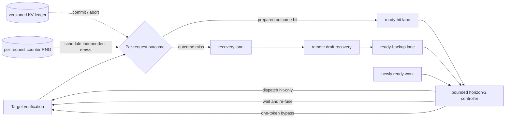

# FissionSpec architecture

FissionSpec is a control plane for **speculative-speculative decoding** (SSD): a
draft model prepares continuations for likely target-verification outcomes while
the current verification is still running. This document uses “SSD” in that
specific sense, not as shorthand for self-speculative decoding.

The key abstraction is an outcome event, not a batch round. Every row leaving a
target verification becomes independently schedulable.

An SSD outcome-cache hit is **not** the same event as accepting draft tokens.
The verifier first emits between one and `k` target-authorized tokens according
to its accepted prefix; independently, the realized `(accepted length, bonus
token)` either names a continuation prepared for the next round or misses that
cache. FissionSpec changes scheduling only for the latter lookup. The simulator
therefore uses separate counter-addressed streams for token acceptance and
cache membership.



## Why the outcome boundary matters

Saguaro's batch analysis assumes the entire batch invokes fallback when any row
misses its speculation cache. For independent hit probabilities `p_i`, that
happens with probability

```text
P(batch fallback) = 1 - product(p_i).
```

If every row has hit probability `p`, the aggregate head-of-line wait imposed by
a deterministic recovery of duration `R` is `B R (1 - p^B)`. Perfect per-row
isolation reduces it to `B R (1 - p)`, an amplification reduction of

```text
(1 - p^B) / (1 - p) = 1 + p + ... + p^(B-1).
```

Immediate fission is not always optimal: hit-only batches can be too small to
use the target efficiently. FissionSpec therefore considers the next known
internal readiness cohort and compares two-batch aggregate-flow costs:

1. launch the ready rows now, then launch recovered rows; or
2. wait within a hard coalescing/SLO bound and fuse compatible rows.

The Python controller sees only the earliest internally known completion cohort
(recovery or in-flight precompute), never future external arrivals. It prices
the exact packed widths of those rows. The Rust primitive additionally supports
priority weights over a flattened service-unit profile. Both are deliberately
model-predictive rather than learned.

## Execution lanes

- `READY_HIT`: the outcome was in the SSD speculation cache; a full speculative
  continuation can be verified immediately.
- `RECOVERING`: no valid continuation exists yet. The row is absent from target
  batches, so it contributes neither head-of-line delay nor padded verifier
  slots.
- `READY_BACKUP`: fallback drafting finished; the request may rejoin a later
  target batch.
- `BYPASS`: an optional SPECTRE-compatible action submits one real token and
  pads the remaining verification width. It trades target work for progress.

The bundled `spectre-parallel-padded` policy isolates the padded parallel-mode
mechanism from SPECTRE. It is not an implementation of SPECTRE's batch-level
ordinary/parallel threshold, remote-draft priority scheduler, or prompt
compression. Those remain required production baselines.

## Correctness substrate

Batch fission must change execution order without changing the token
distribution. This artifact test-drives two prerequisites for that obligation:

1. Each asynchronous message carries `(request_id, round_id, version)`. A late
   result can never mutate a newer request epoch.
2. Random draws are counter-based and keyed by request and logical round, never
   by wall-clock execution order. Rebatching therefore cannot consume another
   request's random stream. Each result also carries the RNG fingerprint, and
   the paired counterfactual API rejects traces with different provenance.

The symbolic KV ledger models committed pages and outcome-specific provisional
branches. A partial committed tail is copy-on-write; only the selected,
target-verified prefix can replace it. Sibling branches abort idempotently, and
generational page handles reject stale releases (the allocator equivalent of
the ABA problem). The count-level simulator does not execute token IDs, logits,
or rejection sampling, so end-to-end distribution preservation remains an
engine-integration acceptance gate.

## Runtime integration boundary

The reference code does not pretend to execute transformer kernels. A serving
engine integration needs four narrow callbacks:

```text
reserve(request_epoch, verification_width) -> block_table
on_verify_complete(request_epoch, accepted, outcome_key) -> transition
on_recovery_complete(request_epoch, continuation) -> transition
next_batch(now, ready, recovering, latency_profile) -> dispatch action
```

Moving a request between lanes changes block-table descriptors only. It must not
copy committed KV data. See `integrations/sglang/` for the primary engine-facing
contract and `integrations/vllm/` for the secondary patch boundary.

## Python/Rust cost-model boundary

The two implementations are complementary references, not differential ports.
Python keeps request-row capacity and an explicit physical-slot vector, using a
two-dimensional `target_latency_ms(rows, slots)` surface. Rust accepts a single
`service_units` value per item, sums it for capacity and latency lookup, and adds
priority-weighted flow plus bypass reasons without allocation. An integration
may map `service_units` to verifier slots only after fixing a row/CUDA-graph
bucket; otherwise it must retain a two-dimensional engine profile. Claims of
bit-for-bit Python/Rust equivalence would require golden fixtures that are not
part of this artifact.

## Simulator boundary

`arrival_ms` means decode-ready time: prefill and the first proposal have
already completed. The target and draft timelines are independent, but the
reference draft engine is a non-preemptive FIFO rather than a full continuous-
batching remote server. TBT counts zero gaps within a block returned by one
verification and excludes TTFT. These choices make the mechanism falsifiable;
they do not constitute end-to-end serving evidence.

The model takes cache-hit probability as exogenous and charges precomputation
by request rows. It does not model outcome-tree fanout, context length, cache
memory, or a conditional cache-hit/acceptance joint distribution. Those belong
in calibrated traces or the production experiment; the bundled factorial keeps
cache membership and token acceptance independent to isolate the scheduler.
